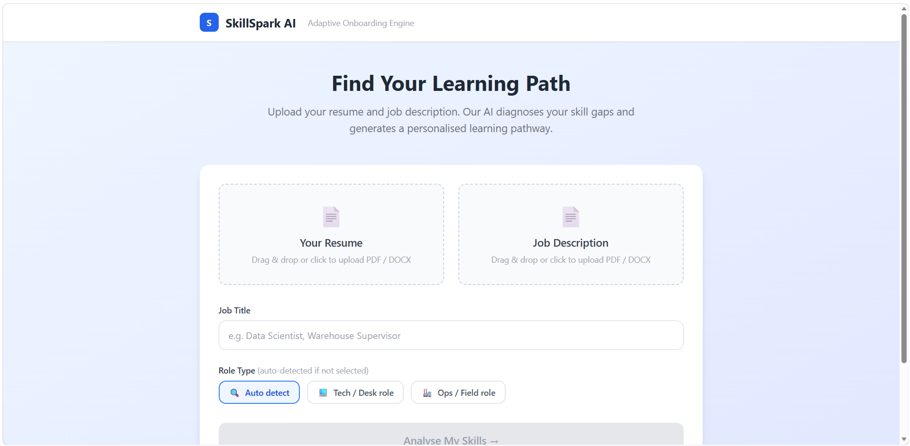
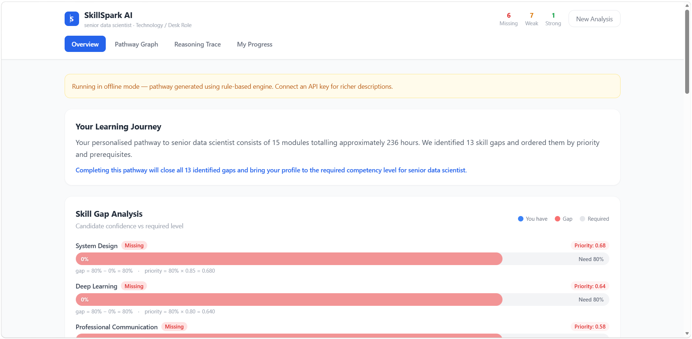
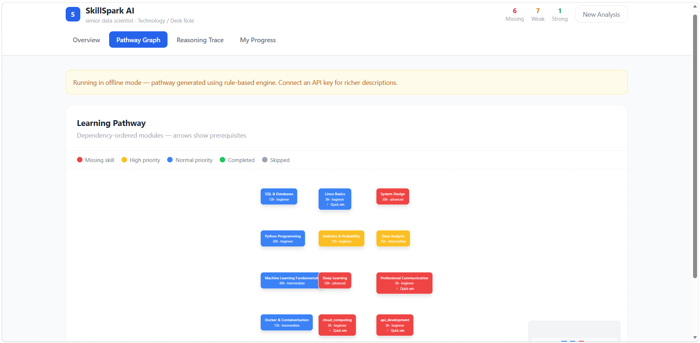
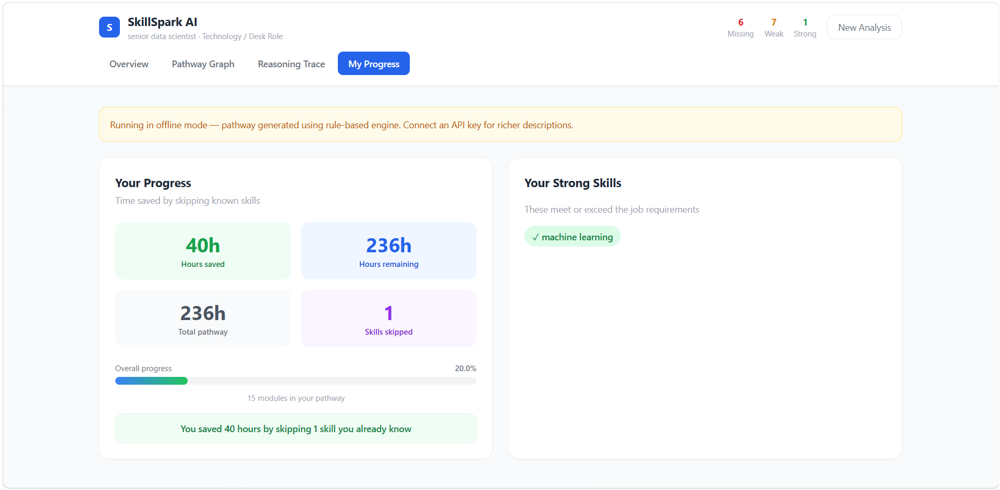
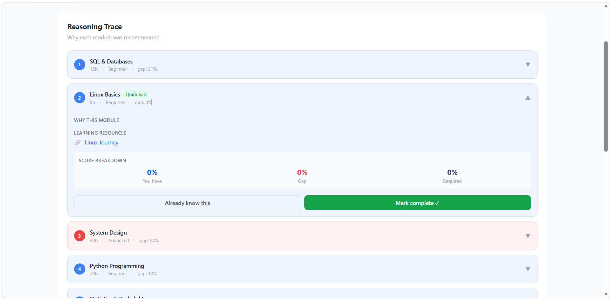

# SkillSpark AI


> AI-powered adaptive onboarding engine that diagnoses skill gaps and generates personalised, dependency-aware learning pathways for job readiness.

Built for **ARTPARK CodeForge Hackathon 2026** — AI-Adaptive Onboarding Engine Challenge.

---

## What it does

SkillSpark AI takes a candidate's resume and a job description, then:

1. **Extracts** skills using spaCy NER with custom O*NET patterns
2. **Normalises** skill names using Sentence Transformers (cosine similarity)
3. **Scores** candidate proficiency from context signals (years, verbs, section)
4. **Calculates** skill gaps using deterministic formulas
5. **Generates** a dependency-ordered learning pathway
6. **Explains** every recommendation with a reasoning trace

---

## How it works
```
Resume + JD Upload
      ↓
spaCy NER (skill extraction)
      ↓
Sentence Transformers (O*NET normalisation)
      ↓
Confidence Scorer (4-signal formula)
      ↓
Gap Engine (gap = required − candidate)
      ↓
Priority Ranker (priority = gap × importance)
      ↓
Dependency Orderer (DFS algorithm)
      ↓
Claude/Gemini API (reasoning traces)
      ↓
React Flow UI (interactive pathway graph)
```

---

## Scoring Formulas (Original Logic)
```python
# Confidence score — inferred from resume context
candidate_confidence = weighted_average(
    years_signal    × 0.40,
    verb_signal     × 0.35,
    section_signal  × 0.25
)

# Gap score
gap_score = required_confidence - candidate_confidence

# Priority score
priority_score = gap_score × importance_weight

# Dependency ordering — DFS algorithm
enforce_order(skill_dependencies_dict)
```

---

## Architecture
```
SkillSpark-AI/
├── backend/
│   ├── core/           # Original logic (confidence, gap, dependencies, reroute)
│   ├── nlp/            # spaCy + Sentence Transformers pipeline
│   ├── ai/             # Claude/Gemini API + fallback engine
│   ├── api/routes/     # FastAPI endpoints
│   └── main.py         # App entry point
├── frontend/
│   ├── src/pages/      # Upload + Dashboard
│   ├── src/components/ # 5 UI components
│   ├── src/hooks/      # usePathway + useReroute
│   └── src/api/        # Axios client
└── data/
    ├── catalog.json              # 20+ course entries
    ├── skill_taxonomy_tech.json  # O*NET tech skills
    └── skill_taxonomy_ops.json   # Custom ops ontology
```

---

## Tech Stack

| Layer    | Technology                                                        |
|----------|-------------------------------------------------------------------|
| Frontend | React + Tailwind CSS + React Flow + Axios                         |
| Backend  | Python + FastAPI + PyMuPDF + python-docx + Pydantic               |
| NLP      | spaCy (en_core_web_lg) + Sentence Transformers (all-MiniLM-L6-v2) |
| AI / LLM | Claude API / Gemini API (auto-detected) + Rule-based fallback     |
| Data     | JSON flat files (catalog + O*NET taxonomy + custom ops ontology)  |
| Deploy   | Docker                                                            |

---

## Setup Instructions

### Prerequisites

- Python 3.10+
- Node.js 18+
- Git

### 1. Clone the repository
```bash
git clone https://github.com/ManavHasmukbhaiRangani/SkillSpark-AI.git
cd SkillSpark-AI
```

### 2. Backend setup
```bash
cd backend
python -m venv venv

# Windows
venv\Scripts\activate

# Mac/Linux
source venv/bin/activate

pip install -r requirements.txt
python -m spacy download en_core_web_lg
```

### 3. Environment variables
```bash
cp .env.example .env
```

Edit `.env` and add your API key:
```bash
# Option 1 — Claude API (Anthropic)
CLAUDE_API_KEY=sk-ant-your-key-here

# Option 2 — Gemini API (Google — free tier)
GEMINI_API_KEY=your-gemini-key-here

# Get free Gemini key at: https://aistudio.google.com/apikey
```

### 4. Run backend
```bash
cd backend
uvicorn main:app --reload --port 8000
```

API docs available at: `http://localhost:8000/docs`

### 5. Frontend setup
```bash
cd frontend
npm install
npm run dev
```

Open: `http://localhost:5173`

---

## Docker Setup
```bash
# From root directory
docker-compose up --build
```

- Frontend: `http://localhost:3000`
- Backend: `http://localhost:8000`
- API Docs: `http://localhost:8000/docs`

---

## API Endpoints

| Method | Endpoint           | Description               |
|--------|--------------------|---------------------------|
| POST   | `/api/v1/upload`   | Upload resume or JD file  |
| POST   | `/api/v1/analyse`  | Run gap analysis pipeline |
| POST   | `/api/v1/pathway`  | Generate learning pathway |
| POST   | `/api/v1/reroute`  | Skip skill + recalculate  |
| POST   | `/api/v1/complete` | Mark skill as completed   |
| GET    | `/health`          | System health check       |

---

## Datasets Used

| Dataset             | Source                                       | Role |
|---------------------|----------------------------------------------|------|
| O*NET 30.1          | [onetcenter.org](https://www.onetcenter.org/database.html) (CC-BY 4.0) | Skill taxonomy + prompt grounding |
| Resume Dataset      | [Kaggle — Sneha Anbhawal](https://www.kaggle.com/datasets/snehaanbhawal/resume-dataset) | Parser validation (F1 score) |
| Jobs + JD Dataset   | [Kaggle — Kshitiz Regmi](https://www.kaggle.com/datasets/kshitizregmi/jobs-and-job-description) | Domain routing accuracy test |
| Custom Ops Ontology | Handcrafted by team | Blue-collar skill nodes |

---

## Validation Metrics

| Metric             | Target        | Method                              |
|--------------------|---------------|-------------------------------------|
| Parser accuracy    | F1 > 0.80     | spaCy + Claude on 50 Kaggle resumes |
| Domain routing     | > 85% correct | Classifier on 30 Kaggle JDs         |
| Hallucination rate | 0%            | Claude grounded to catalog only     |
| Path efficiency    | < baseline    | Fewer hours than naive approach     |

Run validation scripts:
```bash
cd validation
python eval_parser.py
python eval_routing.py
```

---

## UI Screenshots

### 📤 Upload Page


### 📊 Overview Dashboard


### 🧠 Learning Pathway Graph


### 📈 Progress Tracking


### 🧾 Reasoning Trace (AI Explainability)


---

## Team
**The JSONs**

Built for ARTPARK CodeForge Hackathon 2026

---

## License

MIT License — see [LICENSE](LICENSE) for details.
